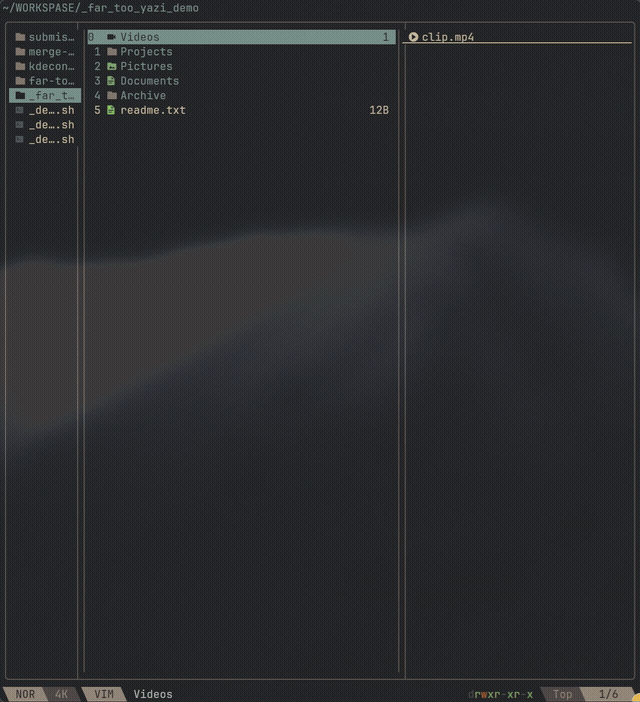

# far-too-yazi



**far-too-yazi is a batteries-included [yazi](https://yazi-rs.github.io/)
distro** — the same idea as [AstroNvim](https://astronvim.com/) for Neovim,
but for yazi: clone it, run `./install.sh`, and you get a fully configured
file manager with 23 plugins already wired together, sane defaults, and a
built-in way to add more — no manual `package.toml` editing, no hunting
plugin READMEs for keymap snippets to copy in by hand. It's aimed at people
who want a file manager that already works, not a base to spend a weekend
configuring.

On top of that, it adds a FAR Manager / Norton Commander style dual-pane
mode on top of yazi's normal single-pane vim-style interface, with a single
keystroke to swap between the two. Stay in yazi's native vim-style
keybindings for everyday browsing, or flip into a classic two-panel
file-manager layout (F5 copy, F6 move, Tab to swap panels, conflict prompts
on collisions) when you're moving files between directories. Both modes are
full yazi keymaps, not an overlay — switching between them relaunches yazi
with the other keymap loaded and your tabs, working directories, and
dual-pane layout restored exactly as you left them. The mode-switch relaunch
works under **fish, bash, or zsh** — `install.sh` sets up whichever of those
you have, so this isn't a fish-only build anymore.

## What's actually new here

yazi doesn't have a built-in dual-pane mode, and yazi has no live
keymap-reload (there's no way to swap keybindings without restarting the
process — see [sxyazi/yazi#1757](https://github.com/sxyazi/yazi/issues/1757)).
This project works around both:

- **A real dual-pane compositor** ([`split-tabs.yazi`](plugins/split-tabs.yazi)) —
  two yazi tabs rendered side by side as one composited view, not a
  third-party dual-pane plugin (one was tried and dropped; see
  [docs/FAR-MODE.md](docs/FAR-MODE.md#why-not-the-stock-dual-pane-plugin)).
  Fixed here: a theme-rendering glitch and a stale-working-directory bug
  that both traced back to pane state not being recomputed correctly on
  restore.
- **Instant mode-switching** ([`far-mode.yazi`](plugins/far-mode.yazi)) — one
  keystroke atomically swaps the keymap file and relaunches yazi (via a shell
  wrapper, see below), restoring your tabs, cwd, active pane, and dual-pane
  state on the other side. Feels instant; it's a fast full restart under the
  hood.
- **Conflict-aware transfers between panes** ([`merge-paste.yazi`](plugins/merge-paste.yazi)) —
  every cross-pane transfer (F5, F6, `Y`, `Ctrl+Y`), not just an explicit
  paste, prompts Overwrite / Merge / Skip / Rename on a name collision.
  Fixed here: copying or moving a file into the other pane now actually
  shows up in that pane's listing immediately — the target pane wasn't
  always refreshing after a cross-pane transfer landed.
- **FAR Manager conveniences**: F2/F9/F11 menus (`far-menu.yazi`), Alt+F10
  fuzzy folder jump (`far-tree.yazi`).
- **Phone browsing over KDE Connect** ([`kdeconnect.yazi`](plugins/kdeconnect.yazi)) —
  mount a paired phone and `cd` straight into it, or send files to it,
  without leaving yazi. A thin wrapper around `kdeconnect-cli --mount`,
  `--get-mount-point`, and `--share` — see the plugin's own README for why
  the existing `kdeconnect-send.yazi` and gvfs-path guides don't cover this.
- **Disk mount/unmount/eject** ([`mount.yazi`](plugins/mount.yazi), community
  plugin, used as-is) — lists block devices via `lsblk`, mounts/unmounts via
  `udisksctl`. Since `udisksctl` goes through polkit, mounting or unmounting
  a disk this way can trigger your desktop's own password/keyring prompt —
  that's normal, it's the same authorization dialog a GUI file manager would
  show, not something this config adds on top.
- **A config popup for file-type openers and startup state**
  ([`openers.yazi`](plugins/openers.yazi)) — press `F` (or `Alt+F4` in FAR
  mode) for a two-page popup, no hand-editing config files for either page:
  - **Openers page** — pick which program opens which file extension
    (`a` add, `e`/Enter edit, `d`/`x` delete). This is what actually decides
    what `Enter`/`l` open a file with in this build.
  - **Startup settings page** — the yazi state you want *every* launch to
    start in, persisted so it survives restarts: keymap mode (vim/FAR),
    panel layout (single / dual / dual+preview), hidden files, sort field,
    folders-first, reverse-sort. `Tab` switches between the two pages;
    `h`/`l` or Enter/Space cycle a value on the settings page.

  Fixed recently: opening a file used to launch the right program but hand
  it no file to open (a blank editor, an empty player) — an argument-passing
  bug in how the opener command was built. Openers now actually open the
  file you picked, not just the program. This is also what makes
  `smart-enter.yazi`'s Enter/`l` open files at all — yazi's own `[opener]`
  table in `yazi.toml` doesn't drive Enter/l here, so `smart-enter.yazi` was
  patched to read this popup's opener list instead (see Credits).
- **A plugin browser and installer** ([`plugin-manager.yazi`](plugins/plugin-manager.yazi)) —
  `Alt+P` opens a full-window popup (same style as the `F` popup above)
  listing yazi plugins with a description for each: `j`/`k` to move,
  `/` to filter, `Enter`/`i` to install the highlighted one straight into
  your yazi install via `ya pkg add`. It isn't limited to a hand-picked
  shortlist — press `r` inside the popup to pull the live list of 100+
  plugins tagged `topic:yazi-plugin` on GitHub (needs `curl`+`jq`; falls
  back to the bundled list if either is missing or the network doesn't
  answer in time).
- **Drag-and-drop** — `Alt+D` (vim) / `Alt+F6` (FAR) drags the selection out
  to another app; `Alt+I` (vim) / `Alt+F3` (FAR) accepts a drop of files
  from another app into the current directory. kitty (0.47.1+) and iTerm2
  (3.7.0 beta10+) support yazi's native DnD protocol for the drag-out
  direction with no binding needed at all — the bindings here exist for
  every other terminal, via [`dragon`](https://github.com/mwh/dragon) (AUR:
  `dragon-drag-and-drop` — not the KDE media player of the same name in the
  official repos) as the drag source / drop target.
- **The installer checks for yazi itself** — if `yazi` isn't already on
  `PATH`, `install.sh` installs it (pacman/brew/apt→cargo fallback) before
  touching any config.

See [docs/FAR-MODE.md](docs/FAR-MODE.md) for the full module-by-module guide.

## Neovim

Two separate things, don't confuse them:

- **`nvim` as the default opener** ([`yazi.toml`](yazi.toml)) — text files
  open in `nvim` by default (`run = 'nvim "$@"'`). Change this if your
  editor is something else.
- **Running yazi *inside* Neovim** as a file picker (e.g. via a Neovim
  plugin that shells out to yazi in a terminal buffer) — `toggle-pane.yazi`
  detects this case (`os.getenv("NVIM")`, per
  [yazi's own docs on vim integration](https://yazi-rs.github.io/docs/resources#vim))
  and can hide the preview panel by default when yazi is launched that way,
  since Neovim's own buffer is already showing a preview. Wire this up in
  `init.lua` if you use yazi as a Neovim file picker.

## Requirements

- [yazi](https://yazi-rs.github.io/) 26.5.6 or newer (uses `@sync` entries
  and `Tab.layout`/`Tab.build` patching — older versions may not have these).
  `install.sh` installs it for you if it isn't already on `PATH`.
- **fish, bash, or zsh** for the mode-switch relaunch wrapper (`y`).
  `install.sh` detects which of these you have and installs the matching
  wrapper(s) — `fish/y.fish` or `bash/y.sh` (sourced from `.bashrc`/
  `.zshrc`, works under both bash and zsh).
- [`fzf`](https://github.com/junegunn/fzf) for the Alt+F10 folder jump; `fd`
  if you have it (falls back to `find`).
- `gh` (GitHub CLI) is *not* required to use this — only mentioned here
  because that's how this repo itself gets published.

## Install

```sh
git clone https://github.com/PHONE1X/far-too-yazi.git
cd far-too-yazi
./install.sh
```

This backs up any existing `~/.config/yazi` (timestamped, not deleted),
copies this repo's config into `~/.config/yazi`, sets the default keymap to
vim-style, and — if fish is your shell — installs the `y` wrapper function
that mode-switching depends on.

**Use `y` to launch yazi, not the bare `yazi` command**, if you want
vim↔FAR mode switching to work. Plain `yazi` still works for everything
else; it just can't relaunch itself.

Prefer to manage this as a symlinked dotfile instead of a copy?

```sh
./install.sh --symlink
```

This points `~/.config/yazi` straight at the cloned repo, so `git pull`
updates your live config. Existing config is still backed up first.

## Quick usage

Default mode is vim-style (yazi's own keybindings, unmodified, plus the
additions below). From inside yazi:

| Key | Action |
|---|---|
| `Alt+M` | Switch to FAR mode (relaunches yazi) |
| `b t` | Toggle dual-pane view on/off |
| `Ctrl+H` / `Ctrl+L` | Switch active pane (dual-pane) |
| `t` | New workspace (when dual-pane is on) / new tab (when off) |
| `Y` | Move selection to the other pane (dual-pane) / cancel yank (off) |
| `Ctrl+Y` | Copy selection to the other pane (dual-pane only) |
| `F` | Configure file-type openers / startup settings |
| `Alt+D` | Drag-and-drop the selection out (kitty/iTerm2: native; other terminals: via `dragon`) |
| `Alt+I` | Drag-and-drop files in from another app (via `dragon`) |
| `Alt+P` | Browse and install yazi plugins |

FAR mode is always dual-pane. From inside yazi:

| Key | Action |
|---|---|
| `F5` | Copy to the other pane |
| `F6` | Move to the other pane |
| `Tab` | Switch active pane |
| `F2` / `F9` / `F11` | User menu / main menu / plugin commands |
| `Alt+F10` | Fuzzy-jump to a folder (fzf) |
| `Alt+F4` | Configure file-type openers / startup settings |
| `Alt+F6` | Drag-and-drop the selection out (kitty/iTerm2: native; other terminals: via `dragon`) |
| `Alt+F3` | Drag-and-drop files in from another app (via `dragon`) |
| `Alt+P` | Browse and install yazi plugins |

Any transfer that collides with an existing name — F5, F6, `Y`, or
`Ctrl+Y` — prompts Overwrite / Merge folders / Skip / Rename / Cancel,
same as a manual conflict-aware paste, and the destination pane refreshes
immediately so the transferred file is visible right away.

Full keybinding reference and the reasoning behind each module:
[docs/FAR-MODE.md](docs/FAR-MODE.md).

## Limitations

- **Drag-and-drop needs a terminal that supports it, or `dragon`.** Only
  kitty (0.47.1+) and iTerm2 (3.7.0 beta10+) implement yazi's native DnD
  protocol so far; `Alt+D`/`Alt+F6` (out) and `Alt+I`/`Alt+F3` (in) fall
  back to launching `dragon` (AUR: `dragon-drag-and-drop`) everywhere else,
  which needs to be installed separately.
- **The plugin manager's live GitHub fetch (`r`) needs `curl` and `jq`.**
  Without them, or if the network doesn't answer, it just keeps the
  bundled 25-plugin catalog — nothing breaks, the catalog is just shorter.
- **Dual-pane workspaces are 2 panes each**, not N. See Roadmap.
- **Only the active workspace survives a mode-switch relaunch** if you're
  running a build with multiple dual-pane workspaces — background ones
  aren't restored (their underlying tabs aren't lost, just their pane
  layout). Not an issue in this release, since workspaces (plural) aren't
  shipped here yet — noted for when they land.
- **No bookmarks / fast-travel yet.** See Roadmap.

## Roadmap

Not implemented yet, tracked here so it doesn't get lost:

- **Bookmarks / fast-travel for FAR mode** — vim-mode navigation in yazi
  already has quick jump shortcuts; FAR mode has nothing equivalent yet.
  Needs a way to save a directory under a key and jump straight to it,
  Norton-Commander/FAR style, instead of navigating there by hand every
  time.
- **Port more of FAR mode's logic into vim-mode**, including parts of its
  control scheme, where it doesn't conflict with yazi's own vim-style
  bindings — right now the two modes share less than they could.
- **Multiple tabs/workspaces in dual-pane mode** — browser-tab-like
  switching between several independent 2-pane layouts, not just one.
- **3–4 pane layouts**, both in dual-pane and (optionally) single-pane mode
  — the current compositor is hardcoded to exactly 2 panes; extending it to
  a configurable pane count is mostly a data-model change
  (`split-tabs.yazi`'s pane tracking assumes exactly 2 throughout).
- **Tabbed FAR mode** — a visible tab strip in FAR mode showing which
  workspace is active, once multi-workspace support exists.

Contributions on any of these are welcome — see
[docs/FAR-MODE.md](docs/FAR-MODE.md) for the architecture notes you'd need.

## Credits

Built on [yazi](https://yazi-rs.github.io/). Every plugin below is either
original to this project, a fork with real modifications, or a community
plugin used essentially as-is (pinned versions in `package.toml`). None of
it is blind copy-paste — forked/modified plugins are called out explicitly.

**Written for this project (Mihailov / PHONE1X):**

- [`merge-paste.yazi`](plugins/merge-paste.yazi) — conflict-aware paste
  (Overwrite/Merge/Skip/Rename), addressing
  [sxyazi/yazi#982](https://github.com/sxyazi/yazi/issues/982), closed
  "not planned" upstream.
- [`kdeconnect.yazi`](plugins/kdeconnect.yazi) — browse and send files to a
  KDE Connect–paired phone.
- `far-mode.yazi`, `far-menu.yazi`, `far-tree.yazi` — the FAR-mode
  machinery itself: keymap-swap/relaunch, F2/F9/F11 menus, Alt+F10 fuzzy
  folder jump. Written specifically for this project; see
  [docs/FAR-MODE.md](docs/FAR-MODE.md) for how they work.
- [`openers.yazi`](plugins/openers.yazi) — `F` popup for configuring
  file-type openers and startup state (keymap mode, panel layout, hidden
  files, sort order) without hand-editing config files.
- [`plugin-manager.yazi`](plugins/plugin-manager.yazi) — `Alt+P` popup
  listing a curated catalog of yazi plugins with descriptions; installs
  the picked one via `ya pkg add`.

**Forked and modified:**

- [`split-tabs.yazi`](plugins/split-tabs.yazi) — dual-pane compositor,
  originally by [Konstantin Tskhovrebov (terrakok)](https://github.com/terrakok/split-tabs).
  Modified here to fix a theme-rendering bug and a stale-working-directory
  bug on pane restore.
- [`smart-enter.yazi`](plugins/smart-enter.yazi) — originally by
  [yazi-rs](https://github.com/yazi-rs/plugins). Patched to read its
  file-type → program mapping from `openers.yazi`'s popup/config instead of
  yazi's own `[opener]` table (which doesn't drive Enter/`l` in this setup),
  and to work around an opener arg-passing bug that broke opening images,
  video, audio, PDFs, office docs, and archives.

**Community plugins, used as published (see `package.toml` for pinned
versions):**

- [`mount.yazi`](plugins/mount.yazi), [`git.yazi`](plugins/git.yazi),
  [`full-border.yazi`](plugins/full-border.yazi),
  [`chmod.yazi`](plugins/chmod.yazi),
  [`smart-paste.yazi`](plugins/smart-paste.yazi),
  [`toggle-pane.yazi`](plugins/toggle-pane.yazi) — [yazi-rs](https://github.com/yazi-rs/plugins)
- [`compress.yazi`](plugins/compress.yazi) — [Ciarán O'Brien / KKV9](https://github.com/KKV9/compress)
- [`ouch.yazi`](plugins/ouch.yazi) — [ndtoan96](https://github.com/ndtoan96/ouch)
- [`clipboard.yazi`](plugins/clipboard.yazi) — [XYenon](https://github.com/XYenon/clipboard)
- [`relative-motions.yazi`](plugins/relative-motions.yazi) — [dedukun](https://github.com/dedukun/relative-motions)
- [`allmytoes.yazi`](plugins/allmytoes.yazi) — [Sonico98](https://github.com/Sonico98/allmytoes)
- [`restore.yazi`](plugins/restore.yazi) — [boydaihungst](https://github.com/boydaihungst/restore)
- [`recycle-bin.yazi`](plugins/recycle-bin.yazi) — [uhs-robert](https://github.com/uhs-robert/recycle-bin)
- [`ucp.yazi`](plugins/ucp.yazi) — [boydaihungst](https://github.com/boydaihungst)

## License


This project is licensed under the [MIT License](LICENSE).
